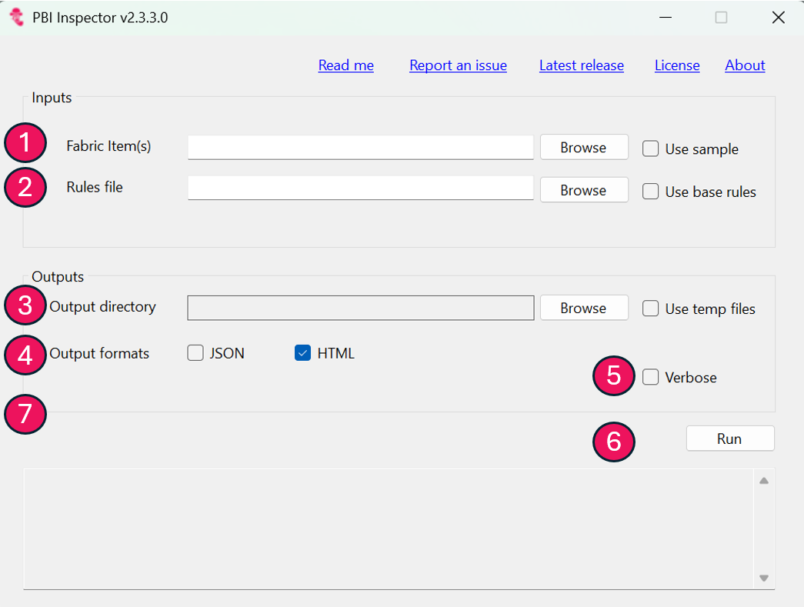
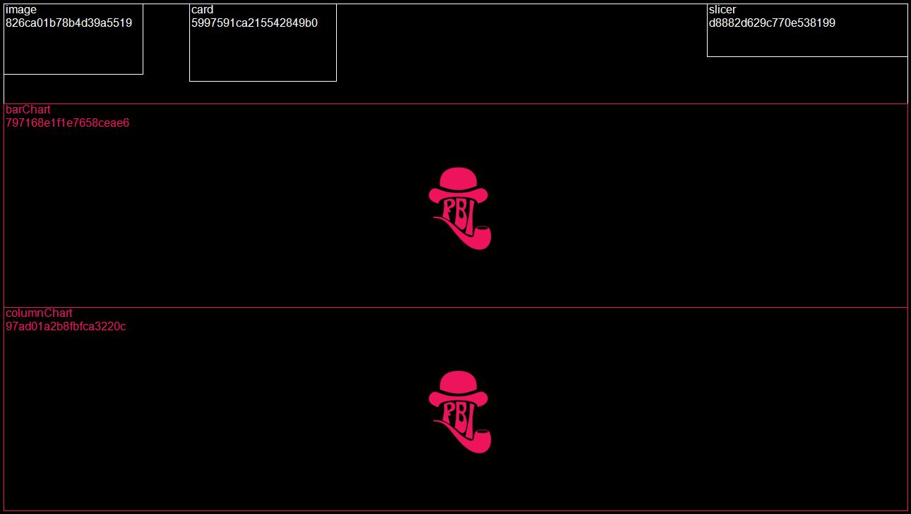
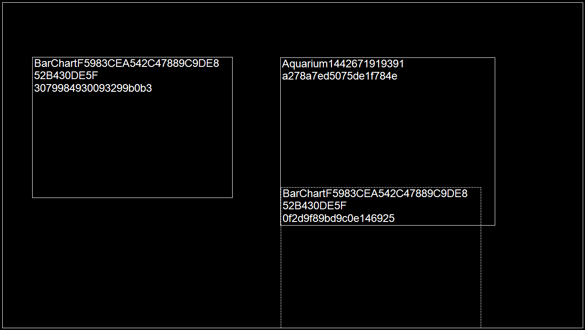
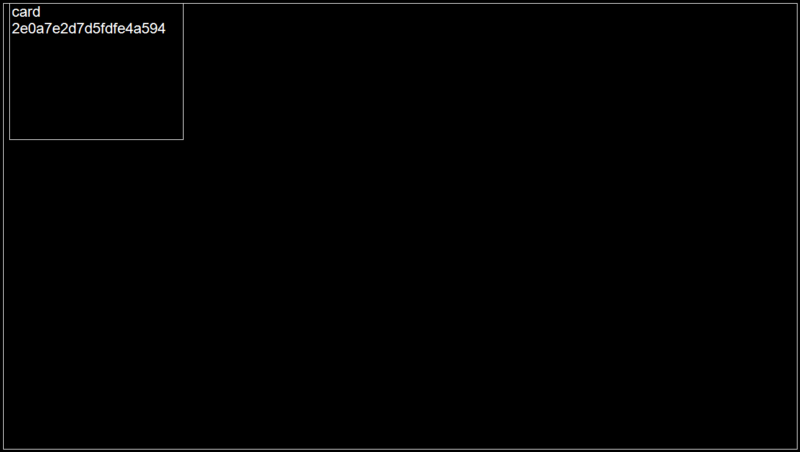

[](https://github.com/NatVanG/PBI-InspectorV2/actions/workflows/github-code-scanning/codeql)
[](https://github.com/NatVanG/PBI-InspectorV2/actions/workflows/tests.yml)
[](https://github.com/NatVanG/PBI-InspectorV2/actions/workflows/docker-publish.yml)
# PBI Inspector V2 (i.e. rules-based CI/CD metadata testing for the Microsoft Power BI visual layer and other Fabric Items)


## NOTE :pencil:

This is a community project that is not supported by Microsoft. 

:exclamation: Aside from Fabric items other than Power BI reports, this version of PBI Inspector is intended to support the new enhanced metadata file format (PBIR), see https://learn.microsoft.com/en-gb/power-bi/developer/projects/projects-report?tabs=desktop#pbir-format. For the older PBIR-legacy file format (see https://learn.microsoft.com/en-gb/power-bi/developer/projects/projects-report?tabs=desktop#report-files), please use the previous version of PBI Inspector available at https://github.com/NatVanG/PBI-Inspector :exclamation:

## Breaking changes :boom:
**PBI Inspector v2.0.0**To support the new enhanced report format (PBIR), a new "part" custom command has been introduced which helps to navigate to or iterate over the new metadata file format's parts such as "Pages", "Visuals", "Bookmarks" etc. Rules defined against the new format are not backward compatible with the older PBIR-legacy format and vice versa.

**PBI Inspector v2.4.1**: Rules' ```part``` iterator and ```part``` custom operator previously allowed for a regular expression to match one or more Fabric item file or folder path(s). As PBI Inspector V2 is now cross-platform, the regular expression would have needed to be platform-agnostic to work across both windows and linux file paths. Furthermore, either forward slashes and back slashes need to be escaped in regular expressions and JSONLogic. To simplify matters, Fabric items' folder paths have been "normalised" and the neutral column character i.e. ':' was chosen to act as folder separator instead therefore, as an example, the part iterator or operator can be set as follows: 

  ```"part":"folder1:.*:copyjob-content.json"``` 
   
  or 

  ```"part":"folder1:.*:copyjob-content\.json$"``` 

 to match a Fabric item path such as (on Windows OS):
 
 ```C:\fabricproject\folder1\copyjob1.CopyJob\copyjob-content.json```

 or on Linux OS:

 ```/home/fabricproject/folder1/copyjob1.CopyJob/copyjob-content.json```

## Thanks :pray:

Thanks to [Michael Kovalsky](https://github.com/m-kovalsky) of [Semantic Link Labs](https://github.com/microsoft/semantic-link-labs) fame and [Rui Romano](https://github.com/ruiromano) for their feedback on this project. Thanks also to [Luke Young](https://www.linkedin.com/in/luke-young-2301/) for creating the original PBI Inspector logo and this new V2 version. 

Special thanks also to [David Mitchell](https://www.linkedin.com/in/davidmitchell85) for his unwavering support and advocacy of PBI Inspector. Check out [David's Microsoft blog post and tooling](https://www.microsoft.com/en-us/microsoft-fabric/blog/2024/12/02/automate-your-migration-to-microsoft-fabric-capacities/) for automating the migration of workspaces from Power BI Premium to Microsoft Fabric capacities.

## Bugs :beetle:

Please report issues [here](https://github.com/NatVanG/PBI-InspectorV2/issues).

## Release notes :scroll:

**PBI Inspector v2.3.0**: PBI Inspector V2 has evolved to support testing any Fabric items' CI/CD metadata, not just Power BI reports! Use either the Windows Forms desktop application or the CLI which now includes the "-fabricitem" command line option and point to a CI/CD folder containing one or more Fabric item definitions. Here's an example rules file that tests a CopyJob Fabric item's metadata: [CopyJob Rules](DocsExamples/Example-CopyJob-Rules.json). Here's another example that tests metadata across Fabric item types: [Cross-Fabric Items Rule](DocsExamples/Example-FabricCrossItem-Rules.json).

**PBI Inspector v2.4.1**: The PBI Inspector V2 CLI is now cross-platform and can be run on both Linux and Windows. This is especially useful when run from either an Azure DevOps pipeline or from GitHub Actions. An easy way to run PBI Inspector V2 (aka Fab Inspector) on a GitHub Ubuntu runner is via the published "fab-inspector" Docker image, see an example GitHub action at https://github.com/NatVanG/fab-inspector-cicd-example/blob/main/.github/workflows/fab-inspector.yml.

The Console output as well as the Azure DevOps and GitHub outputs now include the file path of the current Fabric item being tested or failing a test. This is especically useful when pointing PBI Inspector V2 at a parent folder containing many reports and other Fabric items.

The ""-parallel"" option is now available with the CLI only as an experimental feature, see details in the [Run from the Command line (CLI)](#cli) section.

## <a name="contents"></a>Contents

- [Intro](#intro)
- [Releases](#releases)
- [Base rules](#baserulesoverview)
- [Run from the Graphical user interface](#gui)
- [Run from the Command line (CLI)](#cli)
- [Interpreting results](#results)
- [Azure DevOps and GitHub integration](#ado)
- [Custom rules guide](#customerruleguide)
- [Patching](#patching)
- [Examples](#customrulesexamples)
- [Wiki](#wiki)
- [Known issues](#knownissues)
- [Report an issue](#reportanissue)

## <a id="intro"></a>Intro

So we've DevOps, MLOps and DataOps... but why not VisOps? How can we ensure that business intelligence charts and other visuals within report pages are published in a consistent, performance optimised and accessible state? For example, are local report settings set in a consistent manner for a consistent user experience? Are visuals deviating from the specified theme by, say, using custom colours? Are visuals kept lean so they render quickly? Are charts axes titles displayed? etc.

With Microsoft Power BI, visuals are placed on a canvas and formatted as desired, images may be included and theme files referenced. Testing the consistency of the visuals output has thus far typically been a manual process. The [Power BI Project file format (.pbip) was introduced](https://powerbi.microsoft.com/en-us/blog/deep-dive-into-power-bi-desktop-developer-mode-preview/) then more recently [enhanced](https://learn.microsoft.com/en-gb/power-bi/developer/projects/projects-report) to enable pro developer application lifecycle management and source control also known as CI/CD. PBI Inspector V2 contributes to CI/CD for Power BI reports by providing the ability to define fully configurable testing rules written in json. PBI Inspector V2 is powered by Greg Dennis's Json Logic .NET implementation, see https://json-everything.net/json-logic. 

**PBI Inspector v2.3**: PBI Inspector V2 has evolved to support testing any Fabric items' CI/CD metadata, not just Power BI reports! Use either the Windows Forms desktop application or the CLI which now includes the "-fabricitem" command line option and point to a CI/CD folder containing one or more Fabric item definitions. Here's an example rules file that tests a CopyJob Fabric item's metadata: [CopyJob Rules](DocsExamples/Example-CopyJob-Rules.json). Here's another example that tests metadata across Fabric item types: [Cross-Fabric Items Rule](DocsExamples/Example-FabricCrossItem-Rules.json).

## <a id="releases"></a>Releases

See releases for the Windows application and Command Line interface (CLI) at: https://github.com/NatVanG/PBI-InspectorV2/releases.

## <a id="baserulesoverview"></a>Base rules

While PBI Inspector V2 supports custom rules, it also includes the following base rules defined at https://github.com/NatVanG/PBI-InspectorV2/blob/main/Rules/Base-rules.json. Currently the base rules only test the visual layer of Power BI reports as opposed to other Fabric CI/CD items. Some base rules allow for user parameters as shown below:

1. Remove custom visuals which are not used in the report (no user parameters)
2. Reduce the number of visible visuals on the page (set parameter ```paramMaxVisualsPerPage``` to the maximum number of allowed visible visuals on the page)
3. Reduce the number of objects within visuals (override hardcoded ```6``` parameter value the maximum number of allowed objects per visuals)
4. Reduce usage of TopN filtering visuals by page (set ```paramMaxTopNFilteringPerPage```)
5. Reduce usage of Advanced filtering visuals by page (set ```paramMaxAdvancedFilteringVisualsPerPage```)
6. Reduce number of pages per report (override hardcoded ```10``` parameter value the maximum number of allowed pages per report)
7. Avoid setting ‘Show items with no data’ on columns (no user parameters)
8. Tooltip and Drillthrough pages should be hidden (no user parameters)
9. Ensure charts use theme colours (no user parameters)
10. Ensure pages do not scroll vertically (no user parameters)
11. Ensure alternativeText has been defined for all visuals (disabled by default, no user parameters)

To modify parameters, save a local copy of the Base-rules.json file at https://github.com/NatVanG/PBI-InspectorV2/blob/main/Rules/Base-rules.json and point PBI Inspector V2 to the new file.

To disable a rule, edit the rule's json to specify ```"disabled": true```. At runtime PBI Inspector V2 will ignore any disabled rule.

## <a id="gui"></a>Run from the graphical user interface (GUI)

Running ```PBIRInspectorWinForm.exe``` presents the user with the following interface: 



1. Browse to a local Fabric CI/CD folder containing one or more Fabric CI/CD item definitions or paste the folder path.
2. Either use the base (Power BI) rules file included in the application or select your own.
3. Use the "Browse" button to select an output directory to which the results will be written. Alternatively, select the "Use temp files" check box to write the resuls to a temporary folder that will be deleted upon exiting the application.
4. Select output formats, either JSON or HTML or both. To simply view the test results in a formatted page select the HTML output.
5. Select "Verbose" to output both test passes and fails, if left unselected then only failed test results will be reported.  
6. Select "Run". The test run log messages are displayed at the bottom of the window. If "Use temp files" is selected (or the Output directory field is left blank) along with the HTML output check box, then the browser will open to display the HTML results.
7. Any test run information, warnings or errors are displayed in the console output textbox.

## <a id="cli"></a>Run from the command line interface (CLI)

All command line parameters are as follows:

```-fabricitem folderpath```: Required. The path to the CI/CD folder containing one or more Fabric item(s) definitions. PBI Inspector V2 traverses subfolders so you can specify the root CI/CD folder or a specific subfolder.

```-pbip filepath```: Depreated, use -fabricitem instead. The path to the *.pbip file.

```-pbipreport filepath```: Deprecated, use -fabricitem instead.

```-pbix filepath```: Not currently supported. 

```-rules filepath```: Required. The filepath to the rules file. Save a local copy of the [Base Rules](Rules/Base-rules.json) file and modify as required.

```-verbose true|false```: Optional, false by default. If false then only rule violations will be shown otherwise all results will be listed.

```-parallel true|false```: Currently experimental (i.e. very much in Preview) and optional, false by default. If set to true, the rules will be split into the number of processors available and run in parallel, then the final test results will be combined. If set to false, the rules will be iterated over on a single processor thread.

```-output directorypath```: Optional. If -formats is set to either JSON, HTML or PNG, writes results to the specified directory, any existing files will be overwritten. If not supplied then a temporary directory will be created in the user's temporary files folder. 

```-formats CONSOLE,JSON,HTML,PNG,ADO,GitHub```: Optional. Comma-separated list of output formats. 
- **CONSOLE** (default) writes results to the console output. If "-formats" is not specified then "CONSOLE" will be used by default.
- **JSON** writes results to a Json file.
- **HTML** writes results to a formatted Html page. If no output directory is specified and the HTML format is specified, then a browser page will be opened to display the HTML results. When specifying "HTML" format, report page wireframe images will be created so there is no need to also include the "PNG" format. 
- **PNG** draws report pages wireframes clearly showing any failing visuals. 
- **ADO** outputs Azure DevOps compatible task commands for use in a deployment pipeline. Task commands issued are "task.logissue" and "task.complete", see https://learn.microsoft.com/en-us/azure/devops/pipelines/scripts/logging-commands?view=azure-devops&tabs=bash#task-commands. PBI Inspector V2 rules definition can be given a "logType" attribute of either "warning" or "error" which will be passed to the Azure DevOps task command as follows: ```##vso[task.logissue type=warning|error]```. When specifying "ADO" all other output format types will be ignored.
- **GitHub** similar to ADO but for use in GitHub Actions workflows.


**Commmand line examples:**

- Run "Base-rules.json" rule definitions against PBI report file at "Sales.Report and return results in Json and HTML formats:

``` PBIRInspectorCLI.exe -fabricitem "C:\Files\Sales.Report" -rules ".\Files\Base-rules.json" -output "C:\Files\TestRun" -formats "JSON,HTML"```

- Run "Base-rules.json" rule definitions against PBI report file at "Sales.Report and return results to the console only:

``` PBIRInspectorCLI.exe -fabricitem "C:\Files\Sales.Report" -rules ".\Files\Base-rules.json" -output "C:\Files\TestRun" -formats "Console"```

- Run "Base-rules.json" rule definitions against PBI report file at "Sales.Report and return results as Azure DevOps compatible log and tasks commands (see https://learn.microsoft.com/en-us/azure/devops/pipelines/scripts/logging-commands?view=azure-devops&tabs=bash#task-commands):

``` PBIRInspectorCLI.exe -fabricitem "C:\Files\Sales.Report" -rules ".\Files\Base-rules.json"  -formats "ADO"```

- Run custom rules against CopyJob Fabric items, output as GitHub logging:

``` PBIRInspectorCLI.exe -fabricitem "C:\Files\copyjob1.CopyJob" -rules "C:\Files\Sample-CopyJob-Rules.json" -formats GitHub```

## <a id="results"></a>Interpreting results

 If a verbose output was requested, then results for both test passes and failures will be reported. The JSON output is intended to be consumed by a subsequent process, for example a Power BI report may be created that uses the JSON file as a data source to visualise the PBI Inspector V2 test results. The HTML page is a more readable format for humans and also includes report page wireframe images when tests are at the report page level. These images are intended to help the user identify visuals that have failed the test such as in the example image below. The PBI Inspector V2 logo is also displayed at the centre of each failing visuals as an additional identification aid when the wireframe is busy. 



Visuals with a dotted border are visuals hidden by default as the following example:



## <a id="ado"></a>Azure DevOps and GitHub integration

The PBI Inspector V2 CLI can be run as part of an Azure DevOps pipeline job. By specifying the "-formats ADO" command line option, the CLI will output Azure DevOps compatible task commands for use in a deployment pipeline. PBI Inspector V2 rules definition can be given a "logType" attribute of either "warning" or "error" which will be passed to the Azure DevOps task command as follows: ```##vso[task.logissue type=warning|error]```.

Similarly, the PBI Inspector V2 CLI can be run as part of a GitHub Actions workflow by using the "-formats GitHub" command line option. 

### Tutorials

For a tutorial on how to run PBI Inspector V2 as part of an **Azure DevOps** pipeline job (alongside Tabular Editor's BPA rules), see https://learn.microsoft.com/en-us/power-bi/developer/projects/projects-build-pipelines.  ( :exclamation: Please note that to work with PBI Inspector V2 in Azure DevOps the YAML file referenced in the tutorial needs to be updated as follows: [ContinuousIntegration-Rules-PBIR.yml](DocsExamples/ContinuousIntegration-Rules-PBIR.yml)).

For a tutorial on how to run PBI Inspector V2 as part of a **GitHub Action** workflow using the **Fabric CLI** see https://github.com/RuiRomano/fabric-cli-powerbi-cicd-sample.

For a tutorial on how to run the PBI Inspector V2 CLI as part of a **GitHub Action** workflow using the **[fabric-cicd](https://microsoft.github.io/fabric-cicd/latest/)** Python library, see https://github.com/RuiRomano/pbip-demo.

For a tutorial on how to run the PBI Inspector V2 CLI (aka Fab Inspector) as part of a **GitHub Action** using a **Docker image** see the example repo at https://github.com/NatVanG/fab-inspector-cicd-example/blob/main/.github/workflows/fab-inspector.yml.

## <a id="customerruleguide"></a>Custom Rules Guide

:pencil: This is a high-level guide to custom rules for a deeper explanation of rules and operators see the [PBI Inspector V2 wiki](https://github.com/NatVanG/PBI-InspectorV2/wiki).

Custom rules are defined in a JSON file as an array of rule objects as follows:

```json
{
  "rules": [
  ...
  ]
}
```

Each rule object has the following properties:

```json
{
    "id": "A unique identifier of your choice for the rule",
    "name": "A name that is shown in HTML results with wireframe images.",
    "description": "Details to help you and others understand what this rule does",
    "logType": "Optional. error|warning(default)",
    "itemType": "[fabricitemtype]. The Fabric item type that the rule applies to as referred to in the item's CI\CD ".platform"" file, e.g. CopyJob, Lakehouse, Report, etc. or specify "*" to define a cross-Fabric items rule or "json" to define a rule that applies to any JSON metadata file.",
    "disabled": true|false(default),
    "part": "Optional iterator. A Regex expression to match one or more Fabric item file or folder path, for ease of use folder separators are column characters i.e. ':'. If the itemType is Report, file part abstractions i.e. one of Report|ReportExtensions|Pages|PagesHeader|AllPages|Visuals|AllVisuals|MobileVisuals|AllMobileVisuals|Bookmarks|BookmarksHeader|AllBookmarks can be specified instead of a regular expression to match a specific file type. If an array of multiple items is returned (such as when specifying "Pages"), the rule will apply to each item iterativey."
    "test": [
    //test logic
    ,
    //data variables (optional)
    ,
    //expected result
    ],
    "patch": 
    [
    //optional patch logic to fix the issue
    ]
}
```

For example (without the optional patch logic), the following rule checks that, for each Page, certain charts have both axes titles displayed. The rule returns the names of failing visuals in an array.

```json
{
      "id": "SHOW_AXES_TITLES",
      "name": "Show visual axes titles",
      "description": "Check that certain charts have both axes title showing, returns an array of visual names that fail the test.",
      "logType": "error",
      "itemType": "Report",
      "part": "Pages",
      "disabled": false,
      "test": [
        {
          "map": [
            {
              "filter": [
                {
                  "part": "Visuals"
                },
                {
                  "and": [
                    {
                      "in": [
                        {
                          "var": "visual.visualType"
                        },
                        [
                          "lineChart",
                          "barChart",
                          "columnChart",
                          "clusteredBarChart",
                          "stackedBarChart"
                        ]
                      ]
                    },
                    {
                      "or": [
                        {
                          "==": [
                            {
                              "var": "visual.objects.categoryAxis.0.properties.showAxisTitle.expr.Literal.Value"
                            },
                            "false"
                          ]
                        },
                        {
                          "==": [
                            {
                              "var": "visual.objects.valueAxis.0.properties.showAxisTitle.expr.Literal.Value"
                            },
                            "false"
                          ]
                        }
                      ]
                    }
                  ]
                }
              ]
            },
            {
              "var": "name"
            }
          ]
        },
        {
        },
        []
      ]
    }
 ```

## <a id="patching"></a>Patching

Optionally a rule can now also define a *patch* to fix items (e.g. visuals) failing the test. For example a patch for the test above is as follows. The patch iterates through the failing visual names returned and fixes the "Visuals" part of the report definition by setting the "showAxisTitle" property to "true" for both the category and value axes:

```json
"patch": [
        "Visuals",
        [
          {
            "op": "replace",
            "path": "/visual/objects/categoryAxis/0/properties/showAxisTitle/expr/Literal/Value",
            "value": "true"
          },
          {
            "op": "replace",
            "path": "/visual/objects/valueAxis/0/properties/showAxisTitle/expr/Literal/Value",
            "value": "true"
          }
        ]
      ]
```

A patch definition has the following structure:

```json
"patch": [
        "One of Report|Pages|PagesHeader|AllPages|Visuals|AllVisuals|Bookmarks|BookmarksHeader|AllBookmarks",
        [patch logic operator array]
      ]
```

The patch logic operator array is defined as per the JSON Patch specification at https://tools.ietf.org/html/rfc6902. PBI Inspector V2 uses the .NET implementation of JSON Patch, for see https://docs.json-everything.net/patch/basics/.

Therefore the full rule example including the patch is as follows:

```json
    {
      "id": "SHOW_AXES_TITLES",
      "name": "Show visual axes titles",
      "description": "Check that certain charts have both axes title showing.",
      "part": "Pages",
      "disabled": true,
      "applyPatch": true,
      "test": [
        {
          "map": [
            {
              "filter": [
                {
                  "part": "Visuals"
                },
                {
                  "and": [
                    {
                      "in": [
                        {
                          "var": "visual.visualType"
                        },
                        [
                          "lineChart",
                          "barChart",
                          "columnChart",
                          "clusteredBarChart",
                          "stackedBarChart"
                        ]
                      ]
                    },
                    {
                      "or": [
                        {
                          "==": [
                            {
                              "var": "visual.objects.categoryAxis.0.properties.showAxisTitle.expr.Literal.Value"
                            },
                            "false"
                          ]
                        },
                        {
                          "==": [
                            {
                              "var": "visual.objects.valueAxis.0.properties.showAxisTitle.expr.Literal.Value"
                            },
                            "false"
                          ]
                        }
                      ]
                    }
                  ]
                }
              ]
            },
            {
              "var": "name"
            }
          ]
        },
        {
        },
        []
      ],
      "patch": [
        "Visuals",
        [
          {
            "op": "replace",
            "path": "/visual/objects/categoryAxis/0/properties/showAxisTitle/expr/Literal/Value",
            "value": "true"
          },
          {
            "op": "replace",
            "path": "/visual/objects/valueAxis/0/properties/showAxisTitle/expr/Literal/Value",
            "value": "true"
          }
        ]
      ]
    }
```

Here's another custom rule with patch example that sets the report's default page. First we test the report's activePageName, if it's incorrect we replace it:

```json
{
      "id": "ACTIVE_PAGE",
      "name": "Ensure report's active page index is set to the correct page",
      "description": "",
      "part": "PagesHeader",
      "applyPatch": true,
      "test": [
        {
          "var": "activePageName"
        },
        "ReportSection89a9619c7025093ade1c"
      ],
      "patch": [
        "PagesHeader",
        [
          {
            "op": "replace",
            "path": "/activePageName",
            "value": "ReportSection89a9619c7025093ade1c"
          }
        ]
      ]
    }
```

Although somewhat of an anti-pattern, it is possible to vary a rule's test based on the report name which is retrieved from the .platform file as shown below:

```json
{
      "id": "VARY_BY_REPORT_NAME",
      "name": "Vary by report name",
      "description": "Run rule only if report display name is 'Inventory sample'",
      "test": [
        {
          "?:": [
            {
              "==": [
                {
                  "query": [
                    {
                      "part": ".platform"
                    },
                    {
                      "var": "0.metadata.displayName"
                    }
                  ]
                },
                "Inventory sample"
              ]
            },
            "Rule output",
            "This is another report."
          ]
        },
        "Rule output"
      ]
    }
```

## <a id="customrulesexamples"></a>Rule File Examples

For full rule file examples see:
- [Base Rules](Rules/Base-rules.json) - The set of rules that ships with PBI Inspector V2
- [Example Rules](DocsExamples/Examples-rules.json) - An ever growing library of example rules
- [Example Rules with Patches](DocsExamples/Example-patches.json) - Examples of patches to fix issues
- [CopyJob Rules](DocsExamples/Sample-CopyJob-Rules.json) - Rules to check for CopyJob settings/metadata. Yes you can now test any Fabric item's metadata!
- [Rules Template](DocsExamples/RulesTemplate.json) - A simple rules file  template to get you started with your own rules

## <a id="wiki"></a>Wiki

For an in-depth understanding of PBI Inspector V2 rules and operators see the [PBI Inspector V2 wiki](https://github.com/NatVanG/PBI-InspectorV2/wiki).

## <a id="knownissues"></a>Known issues

-  Currently page wireframes are only created in a 16:9 aspect ratio so custom report page sizes including tooltip pages may not render as expected as shown in the following tooltip page example. See tooltip page example below:
 
 

 - Currently page wireframes do not faithfully represents the report page layout when visual groups are present.


## <a id="reportanissue"></a>Report an issue

Please report issues at https://github.com/NatVanG/PBI-InspectorV2/issues.